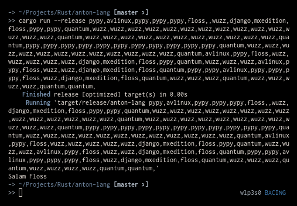

# Anton-lang

Anton Wibowo programming language, based on the [Brainfuck Esoteric Language](https://en.wikipedia.org/wiki/Brainfuck). This is a fork of [Bf](https://github.com/Overv/bf).

## Usages

### Directly writing the code

### From file
